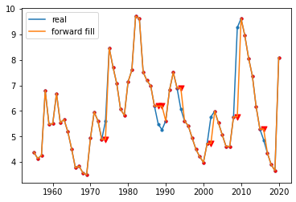
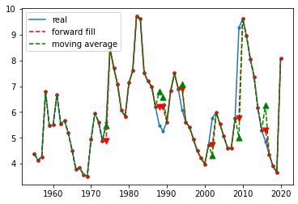
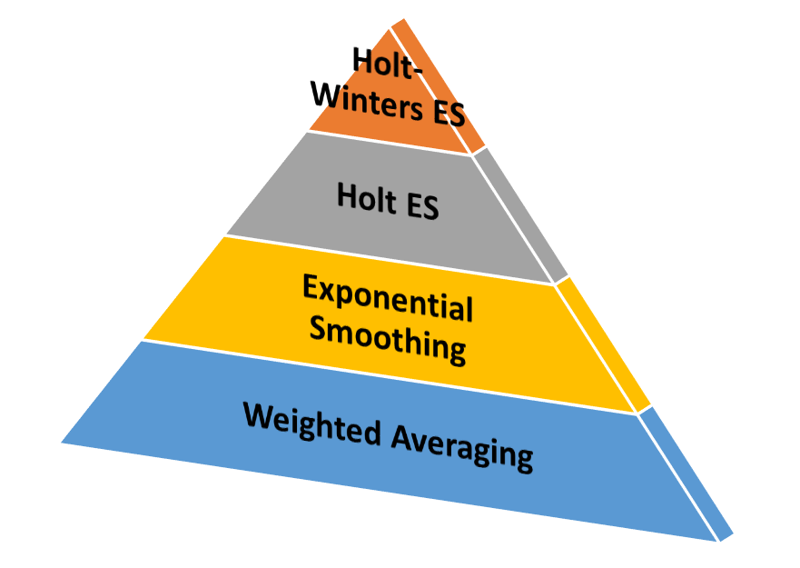
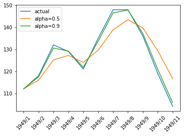
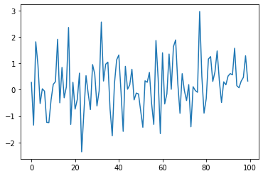

## 时间序列数据分析101
**大纲**

1.概述

2.准备和处理时间序列数据

3.探索式分析(EDA)

4.基于统计学的时间序列分析方法

5.基于状态空间模型的时间序列分析方法

6.基于机器学习的时间序列分析方法

7.基于深度学习的时间序列分析方法

8.模型优化的考虑


### 1. 概述

随着工业界大规模时间序列数据（例如物联网，医疗数字化，智慧城市等领域）的出现和算力的提升，时间序列数据分析的重要性日益凸显。因此伴随着大量时间序列数据被检测和收集，对于基于统计学和机器学习的具有竞争力的分析方法的需求也越来越强。因此在之后的章节中，我们将对时间序列数据分析进行一个全面的探讨。

首先来看时间序列分析的定义：

> 时间序列分析是指从按时间排序的数据点中抽取有价值的总结和统计信息的行为

时间序列分析既包含了对过去数据的诊断，也包括对未来数据的预测。

在最开始，时间序列分析并不是作为一个独立的学科而存在的，而是作为某些学科领域分析方法的一部分，因此有许多领域都对时间序列技术的发展起到了重要贡献。比较典型的例子包括：

- 医学
- 天气
- 经济学
- 天文学

一直到20世纪20年代，时间序列分析才正式脱离于其他学科独立发展，当时的一个标志是自回归模型的应用，这也奠定了基于统计学的时间序列分析的开端。

而基于机器学习的时间序列分析则最早开始于1969年，集成方法被应用于时间序列数据上，到了80年代更多应用场景涌现出来，如异常检测，动态时间规整，循环神经网络等。


### 2.准备和处理时间序列数据

#### 2.1 准备数据集

要进行数据分析之前，首先要准备好时间序列数据集。数据集可以通过两种方式获取：

- 在开源数据仓库中寻找现成数据
- 从非显式数据中构造时间特征，创造时间序列数据

列举几个常用的开源数据仓库,

[UCI Machine Learning Repository](https://archive.ics.uci.edu/ml/index.php)：包含约80个时间序列数据集，从意大利城市小时级空气质量，到糖尿病患者的活动饮食记录等各种各样的数据集。

[UEA and UCR Time Series Classification Repository](http://www.timeseriesclassification.com/index.php)：一个更高质量的时间序列数据集网站。

#### 2.2 寻找时间轴

时间序列在我们身边是广泛存在的，但有时候在数据存储时并没有一列显式存在的时间列，这时候就需要我们去人为寻找和构造。以下是一些不同的时间列存在形式的例子：

- 以事件记录的时间构造时间列
- 以另一个和时间相关的元素构造时间列，例如在一个数据集中行驶距离和时间是正相关的，此时就可以以距离来构造时间列
- 以物理轨迹的顺序作为时间列，例如在医学，天气等领域有些数据是以图片的形式存储的，此时可以从图像中提取时间列

#### 2.3 时间序列可能遇到的问题

在时间序列数据分析中，时间戳是一个十分重要的特征，它能帮我们有效理解数据。

第一个我们会遇到的问题是时间值是在哪个过程产生的，以及何时产生的。通常事件发生的时间和事件被记录的时间往往是不一致的。例如一个研究员先在笔记本上以手写的方式记录，然后在结束研究后再统一以csv的格式录入数据库。那么此时时间戳究竟表示的是手动记录的时间还是录入数据库的时间。

因此在我们看到一个新的时间特征时，总是应当首先确认这个事件时间是如何产生的。作为一个数据分析师，我们应当时刻有这样一种意识，理解数据，理解时间戳的产生过程是我们的责任，只有充分理解了这些，我们才能更好地和其他同事沟通，用数据为业务赋能。

第二个我们会遇到的问题如果我们在处理历史遗留数据，并没有清洗记录的文档说明，也无法找到处理数据流的人来确认时间戳产生的方式。这时需要我们做一些经验上的调查和推断。

有一些通用的方法能帮助我们理解时间特征：1）通过比较不同类别特征（如不同用户）的数据来理解某些时间模式（pattern）是否是共同的。2）使用聚合数据分析来理解时间特征，如该时间戳是本地时间时区还是标准时间时区，该时间反应的是用户行为还是一些外部限制（网络通信）。

第三个值得探讨的问题是什么是一个有意义的时间尺度。当我们拿到一组时间序列数据时，要思考该选择怎么样的时间分辨率，这对于后续特征构造和模型有效性都有很大的影响。通常这取决于你所研究对象的领域知识，以及数据如何被收集的细节。举个例子，假设你正在查看每日销售数据，但如果你了解销售经理的行为就会知道在许多时候他们会等到每周末才报告数字，他们会粗略估计每天的数字，而不是每天记录它们，因为由于退货的存在，每天的数值常常存在系统偏差。所以你可能会考虑将销售数据的分辨率从每天更改为每周以减少这个系统误差。

#### 2.4 清洗数据

数据清洗是数据分析的一个重要环节，对于时间序列数据也不例外，本节将详细介绍针对时间序列数据的数据清洗方法。

- 缺失值处理
- 改变时间频率
- 平滑数据

##### 2.4.1 缺失值处理

缺失值的出现很常见，例如在医疗场景中，一个时间序列数据出现缺失可能有以下原因：

- 病人没有遵从医嘱
- 病人的健康状态很好，因此没必要在每个时刻都记录
- 病人被忘记了
- 医疗设备出现随机性的技术故障
- 数据录入问题

最常用的处理缺失值的方法包括填补（imputation）和删除（deletion）两种。

Imputation:基于完整数据集的其他值填补缺失值

Deletion:直接删除有缺失值的时间段

一般来说，我们更倾向于保留数据而不是删掉，避免造成信息损失。在实际案例中，采取何种方式要考虑是否可以承受删除特定数据的损失。

本节将重点讨论三种数据填补方法，并用python演示如何使用：

- Forward fill
- Moving average
- Interpolation

用到的数据集是美国年度失业率数据，数据集来自[OECD官网](https://data.oecd.org/unemp/unemployment-rate-forecast.htm)。

**Forward fill**

前向填充法是用来填补数据最简单的方法之一，核心思想是用缺失值之前出现的最近一个时间点的数值来填补当前缺失值。使用这种方法不需要任何数学或复杂逻辑。

与前向填充相对应的，还有一种backward fill的方法，顾名思义，是指用缺失值之后出现的最近一个时间点的数值来填充。但是使用这种方法需要特别谨慎，因为这种方法是一种lookahead行为，只有当你不需要预测未来数据的时候才能考虑使用。

总结前向填充法的优点，计算简单，很容易用于实时流媒体数据。


**Moving average**

移动平均法是填补数据的另一种方法，核心思想是取出缺失值发生之前的一段滚动时间内的值，计算其平均值或中位数来填补缺失。在有些场景下，这种方法会比前向填充效果更好，例如数据的噪声很大，对于单个数据点有很大的波动，但用移动平均的方法就可以弱化这些噪声。

同样的，你也可以使用缺失值发生之后的时间点计算均值，但需要注意lookahead问题。

另外一个小trick是，计算均值时可以根据实际情况采取多种方法，如指数加权，给最近的数据点赋予更高的权重。


**Interpolation**

插值是另一种确定缺失数据点值的方法，主要基于我们希望整体数据如何表现的各种图像上的约束。 例如，线性插值要求缺失数据和邻近点之间满足一定的线性拟合关系。因此插值法是一种先验方法，使用插值法时需要代入一些业务经验。

在许多情况下，线性（或样条）插值都是非常合适的。例如考虑平均每周温度，其中存在已知的上升或上升趋势，气温下降取决于一年中的时间。或者考虑一个已知年度销售数据
不断增长的业务。在这些场景下，使用插值法都能取得不错的效果。

当然也有很多情况不适合线性（或样条）插值的场景。例如在天气数据集中缺少降水数据，就不应在已知天数之间进行线性推断，因为降水的规律不是这样的。同样，如果我们查看某人每天的睡眠时间，我们也不应该利用已知天数的睡眠时间线性外推。


**Python代码实现**

```python
import pandas as pd
import numpy as np
import matplotlib.pyplot as plt
%matplotlib inline
pd.set_option('max_row',1000)
```


```python
# 导入美国年度失业率数据
unemploy = pd.read_csv('data\\unemployment.csv')
```


```python
unemploy.head()
```

<table border="1" class="dataframe">
  <thead>
    <tr style="text-align: right;">
      <th></th>
      <th>year</th>
      <th>rate</th>
    </tr>
  </thead>
  <tbody>
    <tr>
      <th>0</th>
      <td>1955</td>
      <td>4.383333</td>
    </tr>
    <tr>
      <th>1</th>
      <td>1956</td>
      <td>4.141667</td>
    </tr>
    <tr>
      <th>2</th>
      <td>1957</td>
      <td>4.258333</td>
    </tr>
    <tr>
      <th>3</th>
      <td>1958</td>
      <td>6.800000</td>
    </tr>
    <tr>
      <th>4</th>
      <td>1959</td>
      <td>5.475000</td>
    </tr>
  </tbody>
</table>


```python
# 构建一列随机缺失值列
unemploy['missing'] = unemploy['rate']
# 随机选择10%行手动填充缺失值
mis_index = unemploy.sample(frac=0.1,random_state=999).index
unemploy.loc[mis_index,'missing']=None
```

**1.使用 forward fill填补缺失值**


```python
unemploy['f_fill'] = unemploy['missing']
unemploy['f_fill'].ffill(inplace=True)
```


```python
# 观察填充效果
plt.scatter(unemploy.year,unemploy.rate,s=10)
plt.plot(unemploy.year,unemploy.rate,label='real')
plt.scatter(unemploy[~unemploy.index.isin(mis_index)].year,unemploy[~unemploy.index.isin(mis_index)].f_fill,s=10,c='r')
plt.scatter(unemploy.loc[mis_index].year,unemploy.loc[mis_index].f_fill,s=50,c='r',marker='v')
plt.plot(unemploy.year,unemploy.f_fill,label='forward fill')
plt.legend()
```



**2.使用moving average填补缺失值**


```python
unemploy['moveavg']=np.where(unemploy['missing'].isnull(),
                             unemploy['missing'].shift(1).rolling(3,min_periods=1).mean(),
                             unemploy['missing'])
```


```python
# 观察填充效果
plt.scatter(unemploy.year,unemploy.rate,s=10)
plt.plot(unemploy.year,unemploy.rate,label='real')
plt.scatter(unemploy[~unemploy.index.isin(mis_index)].year,unemploy[~unemploy.index.isin(mis_index)].f_fill,s=10,c='r')
plt.scatter(unemploy.loc[mis_index].year,unemploy.loc[mis_index].f_fill,s=50,c='r',marker='v')
plt.plot(unemploy.year,unemploy.f_fill,label='forward fill',c='r',linestyle = '--')
plt.scatter(unemploy[~unemploy.index.isin(mis_index)].year,unemploy[~unemploy.index.isin(mis_index)].moveavg,s=10,c='r')
plt.scatter(unemploy.loc[mis_index].year,unemploy.loc[mis_index].moveavg,s=50,c='g',marker='^')
plt.plot(unemploy.year,unemploy.moveavg,label='moving average',c='g',linestyle = '--')
plt.legend()
```



    


**3.使用interpolation填补缺失值**


```python
# 尝试线性插值和多项式插值
unemploy['inter_lin']=unemploy['missing'].interpolate(method='linear')
unemploy['inter_poly']=unemploy['missing'].interpolate(method='polynomial', order=3)
```


```python
# 观察填充效果
plt.plot(unemploy.year,unemploy.rate,label='real')
plt.plot(unemploy.year,unemploy.inter_lin,label='linear interpolation',c='r',linestyle = '--')
plt.plot(unemploy.year,unemploy.inter_poly,label='polynomial interpolation',c='g',linestyle = '--')
plt.legend()
```


    

##### 2.4.2 改变数据集时间频率

通常我们会发现来自不同数据源的时间轴常常无法一一对应，此时就要用到改变时间频率的方法进行数据清洗。由于无法改变实际测量数据的频率，我们能做的是改变数据收集的频率，也就是本节提到的上采样（upsamping）和下采样（downsampling）。

**下采样**

下采样指的是减少数据收集的频率，也就是从原始数据中抽取子集的方式。

以下是一些下采样会用到的场景：

- 数据原始的分辨率不合理：例如有一个记录室外温度的数据，时间频率是每秒钟一次。我们都知道，气温不会在秒钟这个级别有明显的变化，而且秒级的气温数据的测量误差甚至会比数据本身的波动还要大，因此这个数据集有着大量的冗余。在这个案例中，每隔n个元素取一次数据可能更合理一些。

- 关注某个特定季节的信息：如果担心某些数据存在季节性的波动，我们可以只选择某一个季节（或月份）进行分析，例如只选择每年一月份的数据进行分析。
- 进行数据匹配：例如你有两个时间序列数据集，一个更低频（年度数据），一个更高频（月度数据），为了将两个数据集匹配进行下一步的分析，可以对高频数据进行合并操作，如计算年度均值或中位数，从而获得相同时间轴的数据集。

**上采样**

上采样在某种程度上是凭空获得更高频率数据的方式，我们要记住的是使用上采样，只是让我们获得了更多的数据标签，而没有增加额外的信息。

以下是一些上采样会用到的场景：

- 不规律的时间序列：用于处理多表关联中存在不规则时间轴的问题。

  例如现在有两个数据，一个记录了捐赠的时间和数量

  | amt  |    dt     |
  | :--: | :-------: |
  |  99  | 2019-2-27 |
  | 100  | 2019-3-2  |
  |  5   | 2019-6-13 |
  |  15  | 2019-8-1  |
  |  11  | 2019-8-31 |
  | 1200 | 2019-9-15 |

  另一个数据记录了公共活动的时间和代号

  | identifier |    dt    |
  | :--------: | :------: |
  |   q4q42    | 2019-1-1 |
  |   4299hj   | 2019-4-1 |
  |    bbg2    | 2019-7-1 |

  这时我们需要合并这两个表的数据，为每次捐赠打上标签，记录每次捐赠之前最近发生的一次公共活动，这种操作叫做rolling join，关联后的数据结果如下。

  | identifier |  dt  |    amt    |
  | :--------: | :--: | :-------: |
  |   q4q42    |  99 | 2019-2-27 |
  |   q4q42    | 100 | 2019-3-2  |
  |   4299hj   |  5  | 2019-6-13  |
  |    bbg2    | 15  | 2019-8-1    |
  |    bbg2    | 11  |2019-8-31    |
  |    bbg2    | 1200| 2019-9-15   |

- 进行数据匹配：类似下采样的场景，例如我们有一个月度的失业率数据，为了和其他数据匹配需要转换成日度的数据，如果我们假定新工作一般都是从每个月第一天开始的，那么可以推演认为这个月每天的失业率都等于该月的失业率。

通过以上的案例我们发现，即使是在十分干净的数据集中，由于需要比较来自不同维度的具有不同尺度的数据，也经常需要使用到上采样和下采样的方法。

##### 2.4.3 平滑数据

数据平滑也是一个常用的数据清洗的技巧，为了能讲述一个更能被理解的故事，在数据分析前常常会进行平滑处理。数据平滑通常是为了消除一些极端值或测量误差。即使有些极端值本身是真实的，但是并没有反应出潜在的数据模式，我们也会把它平滑掉。

在讲述数据平滑的概念时，需要引入下图层层递进。



weighted averaging，也就是上文曾经讲过的moving average，也是一种最简单的平滑技术，即可以给予数据点相同的权重，也可以给越邻近的数据点更高的权重。

exponential smoothing，本质上和weighted averaging类似，都是给越邻近的数据点更高的权重，区别在于衰减的方式不同，指数平滑法顾名思义，从最邻近到最早的数据点的权重呈现指数型下降的规律，weighted averaging需要为每一个权重指定一个确定值。指数平滑法在很多场景下效果都很好，但它也有一个明显的缺点，无法适用于呈现趋势变化或季节性变化的数据。

t时刻的指数平滑后的值可以用以下公式表示，
$$
S_t = \alpha * x_{t} + (1 – \alpha) * S_{t-1}
$$
其中$St,S_{t-1}$表示当前时刻和上一个时刻的平滑值，$x_t$表示当前时刻的实际值，$\alpha$表示平滑系数，该系数越大则越近邻的数据影响越大。

Holt Exponential Smoothing，这种技术通过引入一个额外的系数，解决了指数平滑无法应用于具有趋势特点数据的不足，但但是依然无法解决具有季节性变化数据的平滑问题。

Holt-Winters Exponential Smoothing，这种技术通过再次引入一个新系数的方式同时解决了Holt Exponential Smoothing无法解决具有季节性变化数据的不足。简单来说，它是在指数平滑只有一个平滑系数的基础上，额外引入了趋势系数和季节系数来实现的。这种技术在时间序列的预测上（例如未来销售数据预测）有着很广泛的应用。

**Python实现指数平滑**

```python
# 导入航空乘客数据
air = pd.read_csv('data\\air.csv')
# 设置两种平滑系数
air['smooth_0.5']= air.Passengers.ewm(alpha =0.5).mean()
air['smooth_0.9']= air.Passengers.ewm(alpha =0.9).mean()
# 可视化展现
plt.plot(air.Date,air.Passengers,label='actual')
plt.plot(air.Date,air['smooth_0.5'],label='alpha=0.5')
plt.plot(air.Date,air['smooth_0.9'],label='alpha=0.9')
plt.xticks(rotation=45)
plt.legend()
```




### 3. 探索式分析(EDA)

常规来说，EDA有一些通用方法，如直方图观察频率分布情况，散点图观察不同列的相关关系，折线图观察趋势变化等，这里不做赘述，下面重点将介绍针对时间序列的特殊方法。

#### 3.1 针对时间序列的特殊方法

对于一个时间序列数据，我们要问的第一个问题是它**是否反映一个平稳的系统**。平稳性的评估很重要，因为这让我们知道在多大程序上历史数据可以用来预测未来数据。确认了平稳性后，我们要接着探索时间序列**是否存在一些内部动态关系**（例如季节性变化），也叫自相关性，这能解释未来数据和历史数据之间有多紧密的关联性。最后，我们需要确保我们找到的关联是**真正的因果关系**，而不是虚假的相关性。

##### 3.1.1 理解平稳性

许多时间序列的统计学模型都是依赖于时间序列是平稳的这一前提条件，通常来说，一个平稳的时间序列指的是这个时间序列在一段时间内具有稳定的统计值，如均值，方差。由于我们对于一个数据是否平稳是有自己的直觉的，所以在实践的过程中要谨防过于依赖直觉而被直觉所欺骗。

为此我们引入了一些统计上的假设检验来测试一个时间序列数据的平稳性。

其中Augmented Dickey Fuller Test (ADF Test) 是最常使用的一种方法，ADF test也是单位根检验（unit root test）的一种。单位根是一个使得时间序列非平稳的一个特征，从技术上说，在下面的公式中如果alpha=1，那么我们说存在单位根。
$$
Y_t = \alpha Y_{t-1} + \beta X_e + \epsilon
$$
其中$Y_t，Y_{t-1}$分别表示t时刻和t-1时刻的时间序列值，$X_e$表示外生变量，$\epsilon$表示误差项。

从直觉上我们可以理解为，只有当alpha<1时，整个时间序列的趋势才是有可能出现逆转的。而ADF test就是对alpha值的假设检验，它的原假设是alpha =1，即原假设成立，则时间序列非平稳。

但是我们需要记住，ADF test不是一个永远行之有效的方法，它存在一些不足：

- 对于区分近似单位根(near unit roots)和单位根不是很有效
- 当数据点很少时，容易出现假阳性的问题
- 大多数测试不会检测所有导致非平稳的因素，例如有些测试只是检验均值或方差两者之一是否平稳，有些测试只是检验总体分布。因此在使用任何假设检验时都要先充分理解数据的特点和检验的限制因素。

此外还有一种Kwiatkowski-Phillips-Schmidt-Shin (KPSS) test也是常用的时间序列平稳性假设检验，它和ADF的区别是KPSS的原假设是关于平稳过程，而ADF的原假设是关于单位根。

时间序列平稳性的重要性在于：

1. 大量的统计学模型基于平稳性的假设
2. 对于一个应用于非平稳时间序列的模型，它的准确性和模型指标会随着时间序列本身变化而变化，从而造成模型本身不稳定。

而对于一个非平稳的时间序列，其实是可以通过一些简单的变换使之变成平稳性的。log变换和平方根变换是两个常用的方式，其适用于非等方差的场景。另外可以通过差分的方式消除时间序列趋势。

**Python代码实现**

```python
from statsmodels.tsa.stattools import adfuller
import pandas as pd
import numpy as np
%matplotlib inline
```

```python
# 导入原始数据
url = 'data/a10.csv'
df = pd.read_csv(url, parse_dates=['date'], index_col='date')
series = df.loc[:, 'value'].values
df.plot(figsize=(14,8), legend=None, title='a10 - Drug Sales Series')
```


    

```python
# 使用ADF Test
result = adfuller(series, autolag='AIC')
print(f'ADF Statistic: {result[0]}')
print(f'n_lags: {result[1]}')
print(f'p-value: {result[1]}')
```

    ADF Statistic: 3.1451856893067363
    n_lags: 1.0
    p-value: 1.0


**p值为1表示没有理由拒绝原假设，也就是存在单位根，时间序列非平稳，这也和我们的直觉是相符的**


```python
# 生产一组随机数检验平稳性
series1 = np.random.randn(100)
plt.plot(series1)
```



    

```python
result1 = adfuller(series1, autolag='AIC')
print(f'ADF Statistic: {result1[0]}')
print(f'p-value: {result1[1]}')
```

    ADF Statistic: -9.588680806555054
    p-value: 2.0639843020333296e-16

**p值远远小于0.05，表示拒绝原假设，即时间序列是平稳的**


#### 3.2 常用的可视化图表