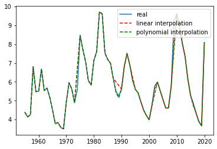

## 时间序列数据分析101
**大纲**

1.概述

2.准备和处理时间序列数据

3.探索式分析(EDA)

4.基于统计学的时间序列分析方法

5.基于状态空间模型的时间序列分析方法

6.基于机器学习的时间序列分析方法

7.基于深度学习的时间序列分析方法

8.模型优化的考虑


### 1. 概述

随着工业界大规模时间序列数据（例如物联网，医疗数字化，智慧城市等领域）的出现和算力的提升，时间序列数据分析的重要性日益凸显。因此伴随着大量时间序列数据被检测和收集，对于基于统计学和机器学习的具有竞争力的分析方法的需求也越来越强。因此在之后的章节中，我们将对时间序列数据分析进行一个全面的探讨。

首先来看时间序列分析的定义：

> 时间序列分析是指从按时间排序的数据点中抽取有价值的总结和统计信息的行为

时间序列分析既包含了对过去数据的诊断，也包括对未来数据的预测。

在最开始，时间序列分析并不是作为一个独立的学科而存在的，而是作为某些学科领域分析方法的一部分，因此有许多领域都对时间序列技术的发展起到了重要贡献。比较典型的例子包括：

- 医学
- 天气
- 经济学
- 天文学

一直到20世纪20年代，时间序列分析才正式脱离于其他学科独立发展，当时的一个标志是自回归模型的应用，这也奠定了基于统计学的时间序列分析的开端。

而基于机器学习的时间序列分析则最早开始于1969年，集成方法被应用于时间序列数据上，到了80年代更多应用场景涌现出来，如异常检测，动态时间规整，循环神经网络等。


### 2.准备和处理时间序列数据

#### 2.1 准备数据集

要进行数据分析之前，首先要准备好时间序列数据集。数据集可以通过两种方式获取：

- 在开源数据仓库中寻找现成数据
- 从非显式数据中构造时间特征，创造时间序列数据

列举几个常用的开源数据仓库,

[UCI Machine Learning Repository](https://archive.ics.uci.edu/ml/index.php)：包含约80个时间序列数据集，从意大利城市小时级空气质量，到糖尿病患者的活动饮食记录等各种各样的数据集。

[UEA and UCR Time Series Classification Repository](http://www.timeseriesclassification.com/index.php)：一个更高质量的时间序列数据集网站。

#### 2.2 寻找时间轴

时间序列在我们身边是广泛存在的，但有时候在数据存储时并没有一列显式存在的时间列，这时候就需要我们去人为寻找和构造。以下是一些不同的时间列存在形式的例子：

- 以事件记录的时间构造时间列
- 以另一个和时间相关的元素构造时间列，例如在一个数据集中行驶距离和时间是正相关的，此时就可以以距离来构造时间列
- 以物理轨迹的顺序作为时间列，例如在医学，天气等领域有些数据是以图片的形式存储的，此时可以从图像中提取时间列

#### 2.3 时间序列可能遇到的问题

在时间序列数据分析中，时间戳是一个十分重要的特征，它能帮我们有效理解数据。

第一个我们会遇到的问题是时间值是在哪个过程产生的，以及何时产生的。通常事件发生的时间和事件被记录的时间往往是不一致的。例如一个研究员先在笔记本上以手写的方式记录，然后在结束研究后再统一以csv的格式录入数据库。那么此时时间戳究竟表示的是手动记录的时间还是录入数据库的时间。

因此在我们看到一个新的时间特征时，总是应当首先确认这个事件时间是如何产生的。作为一个数据分析师，我们应当时刻有这样一种意识，理解数据，理解时间戳的产生过程是我们的责任，只有充分理解了这些，我们才能更好地和其他同事沟通，用数据为业务赋能。

第二个我们会遇到的问题如果我们在处理历史遗留数据，并没有清洗记录的文档说明，也无法找到处理数据流的人来确认时间戳产生的方式。这时需要我们做一些经验上的调查和推断。

有一些通用的方法能帮助我们理解时间特征：1）通过比较不同类别特征（如不同用户）的数据来理解某些时间模式（pattern）是否是共同的。2）使用聚合数据分析来理解时间特征，如该时间戳是本地时间时区还是标准时间时区，该时间反应的是用户行为还是一些外部限制（网络通信）。

第三个值得探讨的问题是什么是一个有意义的时间尺度。当我们拿到一组时间序列数据时，要思考该选择怎么样的时间分辨率，这对于后续特征构造和模型有效性都有很大的影响。通常这取决于你所研究对象的领域知识，以及数据如何被收集的细节。举个例子，假设你正在查看每日销售数据，但如果你了解销售经理的行为就会知道在许多时候他们会等到每周末才报告数字，他们会粗略估计每天的数字，而不是每天记录它们，因为由于退货的存在，每天的数值常常存在系统偏差。所以你可能会考虑将销售数据的分辨率从每天更改为每周以减少这个系统误差。

#### 2.4 清洗数据

数据清洗是数据分析的一个重要环节，对于时间序列数据也不例外，本节将详细介绍针对时间序列数据的数据清洗方法。

- 缺失值处理
- 改变时间频率
- 平滑数据
- 处理季节性问题
- 防止无意识的向前看

##### 2.4.1 缺失值处理

缺失值的出现很常见，例如在医疗场景中，一个时间序列数据出现缺失可能有以下原因：

- 病人没有遵从医嘱
- 病人的健康状态很好，因此没必要在每个时刻都记录
- 病人被忘记了
- 医疗设备出现随机性的技术故障
- 数据录入问题

最常用的处理缺失值的方法包括填补（imputation）和删除（deletion）两种。

Imputation:基于完整数据集的其他值填补缺失值

Deletion:直接删除有缺失值的时间段

一般来说，我们更倾向于保留数据而不是删掉，避免造成信息损失。在实际案例中，采取何种方式要考虑是否可以承受删除特定数据的损失。

本节将重点讨论三种数据填补方法，并用python演示如何使用：

- Forward fill
- Moving average
- Interpolation

用到的数据集是美国年度失业率数据，数据集来自[OECD官网](https://data.oecd.org/unemp/unemployment-rate-forecast.htm)。

**Forward fill**

前向填充法是用来填补数据最简单的方法之一，核心思想是用缺失值之前出现的最近一个时间点的数值来填补当前缺失值。使用这种方法不需要任何数学或复杂逻辑。

与前向填充相对应的，还有一种backward fill的方法，顾名思义，是指用缺失值之后出现的最近一个时间点的数值来填充。但是使用这种方法需要特别谨慎，因为这种方法是一种lookahead行为，只有当你不需要预测未来数据的时候才能考虑使用。

总结前向填充法的优点，计算简单，很容易用于实时流媒体数据。


**Moving average**

移动平均法是填补数据的另一种方法，核心思想是取出缺失值发生之前的一段滚动时间内的值，计算其平均值或中位数来填补缺失。在有些场景下，这种方法会比前向填充效果更好，例如数据的噪声很大，对于单个数据点有很大的波动，但用移动平均的方法就可以弱化这些噪声。

同样的，你也可以使用缺失值发生之后的时间点计算均值，但需要注意lookahead问题。

另外一个小trick是，计算均值时可以根据实际情况采取多种方法，如指数加权，给最近的数据点赋予更高的权重。


**Interpolation**

插值是另一种确定缺失数据点值的方法，主要基于我们希望整体数据如何表现的各种图像上的约束。 例如，线性插值要求缺失数据和邻近点之间满足一定的线性拟合关系。因此插值法是一种先验方法，使用插值法时需要代入一些业务经验。

在许多情况下，线性（或样条）插值都是非常合适的。例如考虑平均每周温度，其中存在已知的上升或上升趋势，气温下降取决于一年中的时间。或者考虑一个已知年度销售数据
不断增长的业务。在这些场景下，使用插值法都能取得不错的效果。

当然也有很多情况不适合线性（或样条）插值的场景。例如在天气数据集中缺少降水数据，就不应在已知天数之间进行线性推断，因为降水的规律不是这样的。同样，如果我们查看某人每天的睡眠时间，我们也不应该利用已知天数的睡眠时间线性外推。


**Python代码实现**

```python
import pandas as pd
import numpy as np
import matplotlib.pyplot as plt
%matplotlib inline
pd.set_option('max_row',1000)
```


```python
# 导入美国年度失业率数据
unemploy = pd.read_csv('data\\unemployment.csv')
```


```python
unemploy.head()
```

<table border="1" class="dataframe">
  <thead>
    <tr style="text-align: right;">
      <th></th>
      <th>year</th>
      <th>rate</th>
    </tr>
  </thead>
  <tbody>
    <tr>
      <th>0</th>
      <td>1955</td>
      <td>4.383333</td>
    </tr>
    <tr>
      <th>1</th>
      <td>1956</td>
      <td>4.141667</td>
    </tr>
    <tr>
      <th>2</th>
      <td>1957</td>
      <td>4.258333</td>
    </tr>
    <tr>
      <th>3</th>
      <td>1958</td>
      <td>6.800000</td>
    </tr>
    <tr>
      <th>4</th>
      <td>1959</td>
      <td>5.475000</td>
    </tr>
  </tbody>
</table>


```python
# 构建一列随机缺失值列
unemploy['missing'] = unemploy['rate']
# 随机选择10%行手动填充缺失值
mis_index = unemploy.sample(frac=0.1,random_state=999).index
unemploy.loc[mis_index,'missing']=None
```

**1.使用 forward fill填补缺失值**


```python
unemploy['f_fill'] = unemploy['missing']
unemploy['f_fill'].ffill(inplace=True)
```


```python
# 观察填充效果
plt.scatter(unemploy.year,unemploy.rate,s=10)
plt.plot(unemploy.year,unemploy.rate,label='real')
plt.scatter(unemploy[~unemploy.index.isin(mis_index)].year,unemploy[~unemploy.index.isin(mis_index)].f_fill,s=10,c='r')
plt.scatter(unemploy.loc[mis_index].year,unemploy.loc[mis_index].f_fill,s=50,c='r',marker='v')
plt.plot(unemploy.year,unemploy.f_fill,label='forward fill')
plt.legend()
```


**2.使用moving average填补缺失值**


```python
unemploy['moveavg']=np.where(unemploy['missing'].isnull(),
                             unemploy['missing'].shift(1).rolling(3,min_periods=1).mean(),
                             unemploy['missing'])
```


```python
# 观察填充效果
plt.scatter(unemploy.year,unemploy.rate,s=10)
plt.plot(unemploy.year,unemploy.rate,label='real')
plt.scatter(unemploy[~unemploy.index.isin(mis_index)].year,unemploy[~unemploy.index.isin(mis_index)].f_fill,s=10,c='r')
plt.scatter(unemploy.loc[mis_index].year,unemploy.loc[mis_index].f_fill,s=50,c='r',marker='v')
plt.plot(unemploy.year,unemploy.f_fill,label='forward fill',c='r',linestyle = '--')
plt.scatter(unemploy[~unemploy.index.isin(mis_index)].year,unemploy[~unemploy.index.isin(mis_index)].moveavg,s=10,c='r')
plt.scatter(unemploy.loc[mis_index].year,unemploy.loc[mis_index].moveavg,s=50,c='g',marker='^')
plt.plot(unemploy.year,unemploy.moveavg,label='moving average',c='g',linestyle = '--')
plt.legend()
```


    


**3.使用interpolation填补缺失值**


```python
# 尝试线性插值和多项式插值
unemploy['inter_lin']=unemploy['missing'].interpolate(method='linear')
unemploy['inter_poly']=unemploy['missing'].interpolate(method='polynomial', order=3)
```


```python
# 观察填充效果
plt.plot(unemploy.year,unemploy.rate,label='real')
plt.plot(unemploy.year,unemploy.inter_lin,label='linear interpolation',c='r',linestyle = '--')
plt.plot(unemploy.year,unemploy.inter_poly,label='polynomial interpolation',c='g',linestyle = '--')
plt.legend()
```



    


